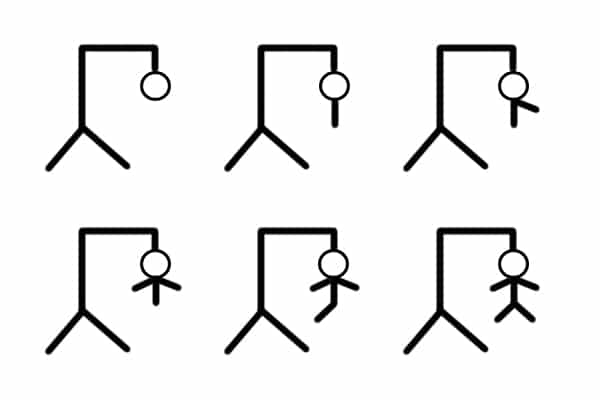

# Juego del Ahorcado
Uno de los famosos juego de adivinanza; juego del ahorcado.

En el presente repositorio se encuentra uno de los primeros juegos que he realizado con python. Este se encuentra en la carpeta 'AHORRCADO', esta esta compuesta por 3 archivos o sripts tipo python, en donde se encuentran las funciones, variables y por último el principal o main, en donde conecta los anteriores y ejecuta el juego.

Durante la elaboración del juego, he definido distintas funciones en las que incluí diferentes bucles for, while y condicionales. También, he utilizado librerías como tkinter and easygui para el uso de ventanas emergentes en donde el jugador pueda ser notificado e ingresar los valores según la etapa del juego, respectivamente. Esto ayuda a una fácil interacción. Al ejecutar el script main_ahorcado.py, aparecerá el menú del juego con varias opciones, como por ejemplo 'Instrucciones', en que recomiendo ver antes de comenzar el juego.

A diferencia del común juego ahorcado, el cual conocemos la mayoría, en donde cada vez que el jugador se equivoca se dibuja una parte del esquema, como se puede observar a continuación:

Imagen recuperada de: https://www.planinfantil.es/plan/el-ahorcado/

El juego que se encuentra en este repositorio cuenta con la opción de agregar el número de intentos con los que se debe adivinar la palabra, es decir, el número de vidas en vez de completar en sus totalidad el dibujo anterior.
